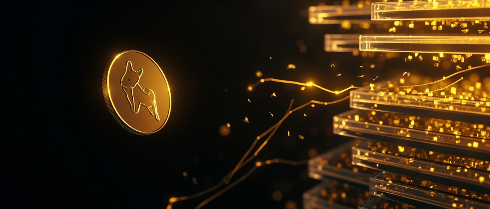
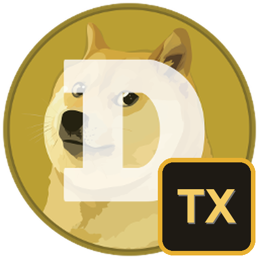

# Dogecoin Core (txindex) — Dogebox pup

<p align="center"></p>
<p align="center"></p>

Fork of the [Dogebox-WG `core` pup](https://github.com/Dogebox-WG/pups/tree/main/core) that runs Dogecoin Core v1.14.9 with **`txindex=1`**, enabling by-transaction lookups (`getrawtransaction` for any txid) for indexers, explorers and analytics.

## Differences from upstream core pup

One flag added to the `dogecoind` invocation in `core-txindex/pup.nix`:

```
-txindex=1
```

Everything else (monitor, logger, interfaces, metrics, ports) is identical, so this pup is a drop-in provider for the `core-rpc` / `core-zmq` / `core-network` interfaces — pups depending on Core can bind to it instead of the stock pup.

## Cost

A txindex node uses roughly **2× the disk** of a standard node (~200 GB vs ~100 GB at current height, growing).

## Install (as a Pup Source)

Dashboard → Pup Store → Manage Sources → add this repo's URL (or a local path on the box), then install "Dogecoin Core (txindex)".

### Avoiding a re-sync when replacing an existing node

If you already run the stock core pup with an indexed datadir, you can seed this pup's storage with it: stop both pups, copy `/opt/dogebox/pups/storage/<old-hash>/` into the new pup's storage dir, start. Same chain → no reindex, no resync.

## Maintenance — automated

This fork tracks upstream automatically:

- `scripts/sync-upstream.sh` — clones `Dogebox-WG/pups`, re-applies the one-line txindex patch to upstream's `pup.nix`, refreshes monitor/logger/logo assets, recomputes the manifest hash, and bumps the patch version. Bails loudly (instead of guessing) if upstream's flags change shape or ship txindex natively.
- `.github/workflows/sync-upstream.yml` — runs the script weekly (Mon 04:23 UTC); commits + tags + pushes when upstream moves.

So when Dogecoin Core (or the pup format) updates upstream, this repo follows within a week with zero human steps. The Dogebox Pup Store then offers the update on your box like any other pup.

## Status

Dev-tier, tested on Dogebox OS beta (NanoPC-T6).
